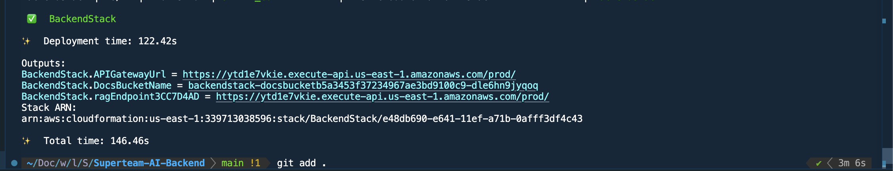

# SuperTeam AI 🤖

This repo focus on building "brain" with AWS Resource, for overview System Architect please view here **[SuperTeam AI Tele](https://github.com/minhbear/Superteam-Tele-bot)**

## **🚀 Deployment Guide**

### Prerequisite
- Install and configure [AWS CLI](https://aws.amazon.com/cli/)
- Install and bootstrap [AWS CDK](https://aws.amazon.com/cdk/)
- Pick a region from the Amazon Bedrock [Supported Regions](https://docs.aws.amazon.com/bedrock/latest/userguide/bedrock-regions.html)

### Deploy
```
cdk deploy
```

**🚀 Result**


Next follow the **[Tele repo README](https://github.com/minhbear/Superteam-Tele-bot/blob/main/README.md)**